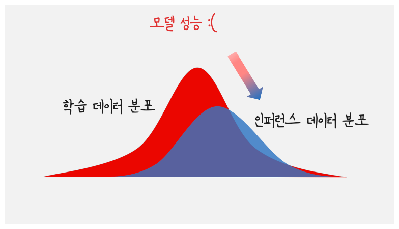
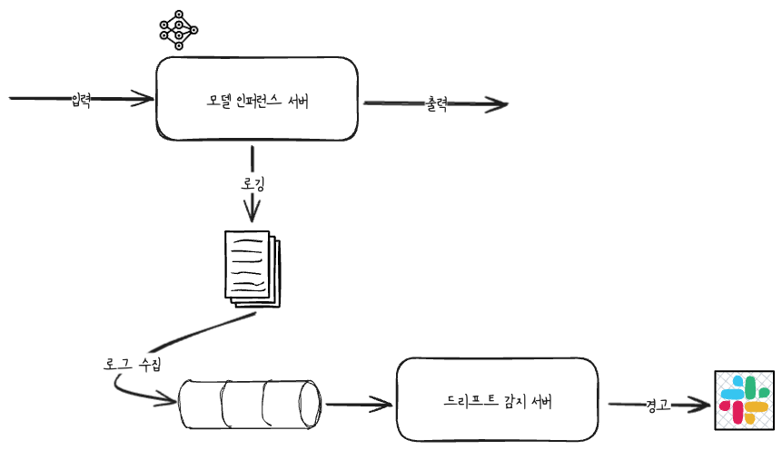
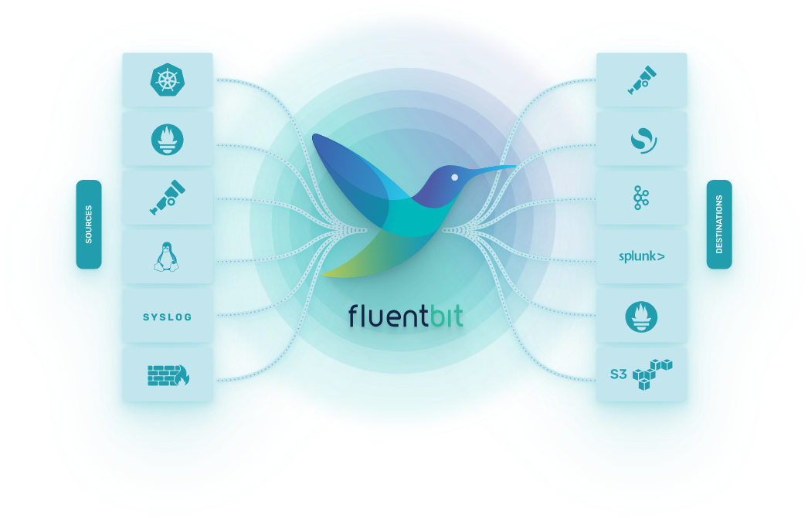
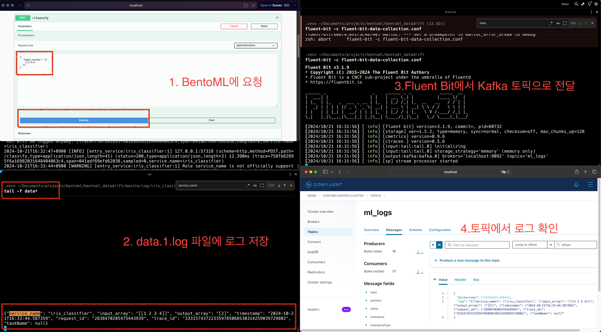
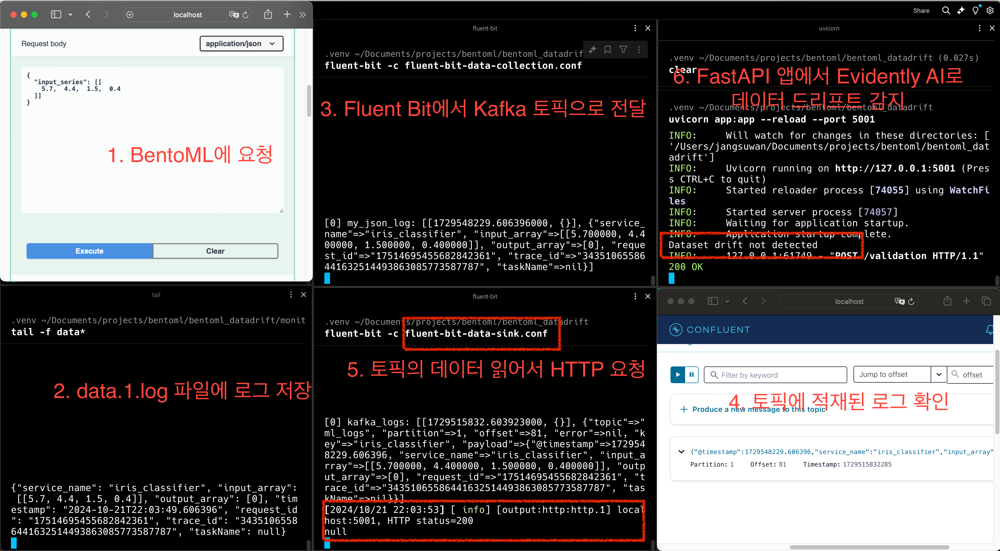

# 데이터 드리프트 감지하기 (w/ BentoML, Evidently AI, Fluent Bit)

데이터 드리프트는 훈련에 사용된 데이터와 실제로 모델이 적용되는 시점의 데이터 간 분포 차이가 발생하는 현상을 말합니다.\
이러한 분포의 차이는 모델 성능을 저하시킬 수 있습니다. 이에 데이터 드리프트를 감지하고 대응하는 것은 중요합니다.




## 아젠다

1. 데이터 드리프트를 감지하는 방법
2. BentoML로 인퍼런스 데이터 로깅
3. Fluent Bit으로 로그 수집
4. Kafka에 수집된 로그 전달
5. Evidently AI로 데이터 드리프트 감지

## 1. 데이터 드리프트를 감지하는 방법

데이터 드리프트를 감지하는 데에는 여러 가지 방법이 존재합니다. 주요 접근 방식은 위 사진에서 알 수 있듯이 훈련 데이터(기준 데이터)와 인퍼런스 시점의 실시간 데이터를 비교하여 데이터 분포의 차이를 감지하는 것입니다.\
데이터를 어떻게 비교하고 드리프트를 감지할지에 따라 다양한 방법을 사용할 수 있습니다.

### 1.1. 통계적 방법

- KL Divergence\
    직관적으로 두 확률 분포간에 차이를 측정하는 방법, 값이 클 수록 드리프트 多

- Jensen-Shannon Divergence\
    KL Divergence의 단점을 보완한 방법, 양쪽 데이터 간의 차이를 고르게 반영

이외에도 Kolmogorov-Smirnov, Chisquare 등 다양한 방법이 존재합니다.

### 1.2. 머신러닝 기반 방법

통계적 방법 외에도, 머신러닝을 활용한 데이터 드리프트 감지 방법도 존재합니다. 이 방법은 훈련 데이터와 인퍼런스 데이터를 하나의 데이터셋으로 결합한 후, 이 데이터를 분류하는 새로운 머신러닝 모델을 학습시키는 방식입니다.

예를들어 Drift Detection Method, Adversarial Validation 와 같은 기법이 있습니다.

### 1.3. 그래서 어떻게?

**Tools**

데이터 드리프트를 감지할 수 있는 다양한 툴이 존재합니다. TFDV, Evidently AI, Seldon Core 등이 있습니다.\
이 중 Evidently AI를 사용하여 데이터 드리프트를 감지하는 방법을 소개하려 합니다.

**How**

인퍼런스 서버로 들어오는 데이터를 모델 예측과 함께 데이터 드리프트를 감지할 수도 있을것입니다.\
하지만 이 방법은 모델 예측 성능에 영향을 미칠 수 있습니다. 따라서 인퍼런스 서버에서는 인퍼런스 데이터를 로깅하고 이를 수집하여 또 다른 서버에서 데이터 드리프트를 감지해야 합니다.



## 2. BentoML로 인퍼런스 데이터 로깅

BentoML은 [Monitoring을 위한 Data Collection](https://docs.bentoml.org/en/latest/guides/observability/monitoring-and-data-collection.html)을 제공합니다. \
*Cloud Monitoring Service 들을 지원하는 것 같은데,, 시도해보다 잘 안되네요*

-> 그래서 저는 기본적(type:"default")으로 제공하는 log 파일에 로깅하는 방법을 사용하였습니다.

```python
@bentoml.api
def classify(self, input_series: np.ndarray) -> np.ndarray:
    with bentoml.monitor(self.service_name) as mon:
        mon.log(
            self.service_name,
            name="service_name",
            role="service_name",
            data_type="text",
        )
        mon.log(
            input_series,
            name="input_array",
            role="feature",
            data_type="numerical_sequence",
        )

        result = self.model.predict(input_series)

        mon.log(
            result, name="output_array", role="prediction", data_type="numerical"
        )
        return result
```

이렇게 정의한 로그는 아래와 같이 JSON 형식으로 ./monitoring/<service_name>/data/data.*.log 파일에 저장됩니다.

```json
# ex) 예시 로그
{
    "service_name": "iris_classifier",
    "input_array": "[[ 0  0  0 18]]",
    "output_array": "[0]",
    "timestamp": "2024-10-21T15:41:13.201061",
    "request_id": "3707933027466346669",
    "trace_id": "12411806532643160228087324403276272721",
    "taskName": null,
}

# 파일 저장 위치
monitoring/
└── iris_classifier
    ├── data
    │   └── data.1.log
    └── schema
        └── schema.1.log
```

로그 파일의 위치는 Bento Service 정의 시 아래와 같이 지정할 수 있습니다.
```python
@bentoml.service(
    name="iris_classifier",
    monitoring={
        "enabled": True,
        "type": "default",
        "options": {
            "log_file_path": "./monitoring", # 여기서 변경 가능, monitoring은 기본값
        },
    },
)
```


## 3. Fluent Bit으로 로그 수집

앞선 과정에서 로깅한 데이터는 모니터렁 뿐 아니라 추후 모델 학습 과정에서도 사용할 수 있습니다.\
이에 Kafka 토픽에 저장해두려 합니다.

이를 위한 방법 중 [Fluent Bit](https://fluentbit.io/)을 사용하고자 합니다. (설치는 `brew install fluent-bit`로 진행했습니다.)

Fluent Bit은 경량의 로그 및 데이터 수집 에이전트로, 다양한 소스에서 데이터를 수집하고 Kafka, S3, BigQuery 등으로 전달할 수 있습니다.



로그 수집을 위한 파이프라인 구성은 아래와 같습니다. (*Kafka 설치는 [여기](https://suwani.tistory.com/151)를 따라서 로컬에 Docker-Compose로 설치했습니다.*)\

- Input: 로그 파일
- Output: Kafka Topic

fluent bit은 기본적으로 .conf 파일에 파이프라인 설정을 정의하고 실행합니다.

```conf
# fluent-bit-data-collection.conf
[Service]
    Flush        5
    Daemon       Off
    Log_Level    info

[INPUT]
    Name         tail
    Path         ./monitoring/*/data/*.log # 경로 확인!! 
    Tag          my_json_log

[OUTPUT]
    Name          kafka
    Match         *
    Brokers       localhost:9092
    Topics        ml_logs # 토픽을 생성해주세요.
    Message_Key_Field service_name # 앞서 로깅 시 service_name 필드를 지정한 것을 메시지 Key로 지정

```

실행
```bash
fluent-bit -c fluent-bit-data-collection.conf
```

이제 로그는 아래와 같이 전달됩니다.





## 4. Kafka에 수집된 로그 전달

토픽에 저장된 로그를 전달하는 방법은 여러가지가 있습니다. 생각하는 가장 쉬운 방법은 Kafka Connector를 사용하는 방법입니다.\
HTTP Sink Connector를 사용하면 API 서버에 손쉽게 메시지를 가지고 Request를 보낼 수 있습니다. 

하지만 여기선 위 단계와 동일하게 Fluent Bit을 사용해보고자 합니다.

Fluent Bit에선 앞서 Log file -> Kafka와 같은 파이프라인을 생성했었습니다.\
이번엔 Kafka -> API 서버로 파이프라인을 구성해보고자 합니다.

사용가능한 [Input](https://docs.fluentbit.io/manual/pipeline/inputs) / [Output](https://docs.fluentbit.io/manual/pipeline/outputs) 컴포넌트를 확인해주세요.

```conf
# fluent-bit-data-sink.conf
[INPUT]
    Name            kafka
    Brokers         localhost:9092
    Topics          ml_logs
    Group_Id        test
    Tag             kafka_logs
    Format          json

[OUTPUT]
    Name            http
    Match           kafka_logs
    Host            localhost
    Port            5001
    URI             /validation
    Format          json

```
토픽에 메시지가 들어오면 localhost:5001/validation 경로로 POST로 요청이 전달됩니다.\
(5번에서 /validation 라우터를 구현해보겠습니다.)

## 5. Evidently AI로 데이터 드리프트 감지

HTTP 요청을 처리할 수 있는 API를 FastAPI로 구현하고자 합니다.\
해당 앱은 /validation 라우터에서 POST 요청을 처리할 수 있어야하고 요청 받은 데이터를 통해 데이터 드리프트를 감지할 수 있어야 합니다.\
앱에서 필요한 것은 학습 시 사용한 데이터와 현재 인퍼런스 데이터입니다.

Evidently AI를 통해 데이터 드리프트를 판단하는 코드를 먼저 보겠습니다.

```python
def is_drift(origin_data: pd.DataFrame, current_data: pd.DataFrame) -> bool:
    data_drift_report = Report(metrics=[DataDriftPreset()])
    data_drift_report.run(reference_data=origin_data, current_data=current_data)
    data_drift_result = data_drift_report.as_dict()
    dataset_drift = data_drift_result["metrics"][0] # DatasetDriftMetric
    return dataset_drift["result"]["dataset_drift"]
```

먼저 Evidently의 Report를 정의한 뒤 DataDriftPreset을 사용해서 드리프트 분석에 필요한 기본 메트릭을 설정합니다.\
이후 run 메서드를 통해 드리프트 분석을 진행압니다.\
코드는 origin_data로부터 current_data의 데이터 드리프트가 발생 했는지 판단합니다.

DataDriftPreset은 두개의 메트릭으로 구성됩니다.
- DatasetDriftMetric: 데이터셋 전체의 드리프트 여부를 판단
- DataDriftTable: 각 컬럼별 드리프트 여부를 판단

위 예시코드는 데이터셋 전체의 드리프트 여부만을 판단해서 True 혹은 False를 반환합니다. 

FastAPI를 앱을 완성하면 아래와 같습니다.

```python
# app.py
import pandas as pd
from evidently.metric_preset import DataDriftPreset
from evidently.report import Report
from fastapi import FastAPI, Request

app = FastAPI()

train_feature_dataset = pd.read_csv("train_feature_dataset.csv")


def is_drift(origin_data: pd.DataFrame, current_data: pd.DataFrame) -> bool:
    data_drift_report = Report(metrics=[DataDriftPreset()])
    data_drift_report.run(reference_data=origin_data, current_data=current_data)
    data_drift_result = data_drift_report.as_dict()
    dataset_drift = data_drift_result["metrics"][0]
    return dataset_drift["result"]["dataset_drift"]


@app.post("/validation")
async def validate_data(request: Request):
    data_list: list[dict] = await request.json()
    features = [item for data in data_list for item in data["payload"]["input_array"]]
    feature_df = pd.DataFrame(features, columns=train_feature_dataset.columns)
    if is_drift(train_feature_dataset, feature_df):
        print("Dataset drift detected")
        # notification ex) Slack 알림
    else:
        print("Dataset drift not detected")
```

지금까지의 내용을 직접 실습하면 아레 사진과 같이 데이터 드리프트 감지까지를 확인할 수 있습니다.



## 마치며

BentoML을 통해 Feature 로깅부터 FastAPI 앱을 통해 데이터 드리프트 감지까지 과정을 수행했습니다.\
이 과정에서의 핵심은 로그를 어떻게 남기느냐, 드리프트 감지를 어떻게 하느냐보다 파이프라인이 중요하다고 생각하고 작성했습니다.\
작성하면서 BentoML의 로깅에 대해 찾아보고 Fluent Bit에 대해서도 알게 되었는데 너무 가볍고 좋은 도구라고 생각들었습니다.

위 과정을 단순히 로컬에서 수행해봤지만, 충분히 확장성 있는 환경에서도 수행할 수 있게 구현 가능하다고 생각됩니다.


